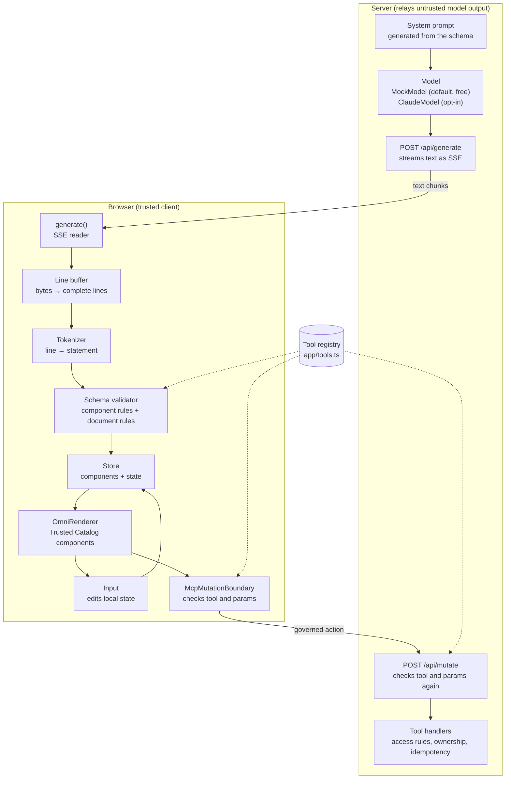

# Omni-IR architecture

How model output becomes a screen, and how a button press reaches the backend. The model's text is untrusted everywhere: the server only relays it, and every check that decides what the screen shows happens in the trusted client.

## Step by step

1. **The model writes Omni-IR.** Its system prompt is generated from the schema, so it describes exactly the components, values and tools the client accepts. By default the server uses a mock model that streams pre-written screens at no cost.
2. **The server relays the text** to the browser as Server-Sent Events, unchanged. It also parses a copy only to log how well the model followed the protocol.
3. **The line buffer** turns network chunks into complete lines, handling multi-byte characters and `\r\n`.
4. **The tokenizer** turns each line into a statement. Text inside strings is never mistaken for syntax.
5. **The schema validator** checks each statement against the catalog and the lines accepted so far. A bad line is rejected with an issue code; the stream carries on.
6. **The store** holds the accepted components and state. Only the component a new line defines changes.
7. **The renderer** draws each component with the app's own catalog. Anything referenced but not yet arrived shows as a placeholder, and becomes a fallback if it never arrives.
8. **An Input** edits state locally. Nothing is sent to the server.
9. **A governed button** goes through McpMutationBoundary, which checks the tool against the registry and the params against the tool's schema before calling `/api/mutate`.
10. **The server checks the tool and params again** before running a handler, because anyone can call `/api/mutate` directly.

The rules for each step are in [SPEC.md](../SPEC.md).
