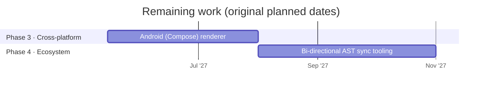

# Omni-IR roadmap

Updated 2026-09-30. Planned dates for the remaining work are kept from the original phased rollout; the work already finished came in ahead of that plan.

## Done

| Phase | Work | Where |
|---|---|---|
| 1 · Core spec | Syntax spec v0.1 draft | [SPEC.md](../SPEC.md) |
| 1 · Core spec | Zod validation schemas | `packages/core/src/schema.ts` |
| 1 · Core spec | Zod schemas and parser published on npm as [`@omni-ir/core`](https://www.npmjs.com/package/@omni-ir/core) 0.1.0 | `packages/core/` |
| 1 · Core spec | Conformance suite (63 cases, including one per component) | [conformance/](../conformance/README.md) |
| 2 · Web reference | Streaming parser in TypeScript, written test-first | `packages/core/` |
| 2 · Web reference | React Trusted Catalog and renderer, with McpMutation governance | `packages/react/` |
| 2 · Web reference | Express streaming server with a free mock model and an opt-in Claude adapter | `server/` |
| 2 · Web reference | Interactive Playground, with its visual design (light and dark, phone layout) | `playground/` |
| 2 · Web reference | Images, ratings, date fields, lists and chat messages | `packages/react/`, `app/assets.ts` |
| 3 · Cross-platform | iOS (SwiftUI) renderer: native parser passing all 63 conformance cases, SwiftUI catalog, streaming client, demo app | `swift/`, `Package.swift` |
| 2 · Web reference | React Catalog SDK published on npm as [`@omni-ir/react`](https://www.npmjs.com/package/@omni-ir/react) 0.1.0, with approved, token-free releases | `packages/react/`, `.github/workflows/release.yml` |

## Planned

Phases 1 and 2 are complete, and so is Phase 3's iOS renderer (ahead of its April 2027 date). Android is next in Phase 3.

## Not yet scheduled

- Real backend tool handlers with authorization, in place of the stubs.
- A check of how well a real model follows the protocol (free manual check with `npm run validate`, or a paid run only with the owner's go-ahead).
- A written goal for the bi-directional AST sync tooling, before that work starts.
