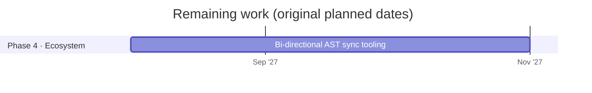

# Omni-IR roadmap

Updated 2026-10-09. Planned dates for the remaining work are kept from the original phased rollout; the work already finished came in ahead of that plan.

## Done

| Phase | Work | Where |
|---|---|---|
| 1 · Core spec | Syntax spec v0.1 draft | [SPEC.md](../SPEC.md) |
| 1 · Core spec | Zod validation schemas | `packages/core/src/schema.ts` |
| 1 · Core spec | Zod schemas and parser published on npm as [`@omni-ir/core`](https://www.npmjs.com/package/@omni-ir/core) 0.1.0 | `packages/core/` |
| 1 · Core spec | Conformance suite (98 cases, including one per component, and 22 transport cases) | [conformance/](../conformance/README.md) |
| 2 · Web reference | Streaming parser in TypeScript, written test-first | `packages/core/` |
| 2 · Web reference | React Trusted Catalog and renderer, with McpMutation governance | `packages/react/` |
| 2 · Web reference | Express streaming server with a free mock model and an opt-in Claude adapter | `server/` |
| 2 · Web reference | Interactive Playground, with its visual design (light and dark, phone layout) | `playground/` |
| 2 · Web reference | Images, ratings, date fields, lists and chat messages | `packages/react/`, `app/assets.ts` |
| 3 · Cross-platform | iOS (SwiftUI) renderer: native parser passing all the conformance cases, SwiftUI catalog, streaming client, demo app | `swift/`, `Package.swift` |
| 3 · Cross-platform | Android (Compose) renderer: Kotlin parser passing all the conformance cases, Compose catalog, streaming client, demo app | `android/` |
| 2 · Web reference | React Catalog SDK published on npm as [`@omni-ir/react`](https://www.npmjs.com/package/@omni-ir/react) 0.1.0, with approved, token-free releases | `packages/react/`, `.github/workflows/release.yml` |
| Since then | Comparison with OpenUI Lang, A2UI, json-render, HTML and React: size, streaming, coverage, capabilities and a reliability run (both formats 9 of 9) | [docs/COMPARISON.md](COMPARISON.md), `benchmarks/` |
| Since then | Catalog expansion: Select, Switch, Table/TableRow, Tabs/Tab and Notice on web, iOS and Android | [PLAN-CATALOG.md](../PLAN-CATALOG.md) |
| Since then | Charts: BarChart, LineChart and PieChart with Series and Slice on web, iOS and Android; the comparison's coverage of OpenUI's scenarios went from 3 of 7 to 5 | [PLAN-CHARTS.md](../PLAN-CHARTS.md) |
| Release | `v0.2.0` (2026-10-04): both npm packages and the first Swift Package Manager version; see [CHANGELOG.md](../CHANGELOG.md) | `.github/workflows/release.yml` |
| Since then | Open to outsiders: a public website with the playground running in the browser, a docs site, the landing page, and contributor, governance, conduct and security documents; GitHub Discussions on | [jdsouza1.github.io/omni-ir](https://jdsouza1.github.io/omni-ir/), [PLAN-OPEN.md](../PLAN-OPEN.md) |
| Since then | Proof and hardening: a cross-model check (Gemini, GPT, Llama) that fixed two prompt problems; fuzz testing on all three parsers with a 2,000-stream cross-language corpus and a weekly long run; adversarial security tests; linear-time parsing (20,000 components: 58 s to 0.4 s); new limits on nesting and document size. Four real problems found and fixed. The Gemini results were confirmed on the official Gemini app (5 of 5 valid) | [PLAN-HARDENING.md](../PLAN-HARDENING.md), [model check](model-check-2026-10-05-models.md) |
| Release | `v0.3.0` (2026-10-05): the charts, on npm and Swift Package Manager | [CHANGELOG.md](../CHANGELOG.md) |
| Release | `v0.4.0` (2026-10-06): proof and hardening (nesting and size limits, linear parsing), on npm and Swift Package Manager | [CHANGELOG.md](../CHANGELOG.md) |
| Since then | Transport standard: how a screen travels from a server to an app is now in the spec (section 10), with 21 transport conformance cases passed by the web, iOS and Android clients; stream versions with an "update the app" notice; screens over AG-UI (`@omni-ir/core/ag-ui`); rate limits behind a proxy | [PLAN-TRANSPORT.md](../PLAN-TRANSPORT.md), [transport guide](../site/docs/guide/transport.md) |
| Release | `v0.5.0` (2026-10-06): the transport standard, stream versions and AG-UI, on npm and Swift Package Manager | [CHANGELOG.md](../CHANGELOG.md) |
| Since then | Real backend handlers in the reference server: an access rule for every tool, sign-in by emailed link with sessions for browsers and tokens for native apps, ownership checks that answer "not found" for other people's data, storage in memory or SQLite, idempotency keys in the spec and all three clients, an audit trail without personal data, and per-person limits | [PLAN-BACKEND.md](../PLAN-BACKEND.md), [guide](../site/docs/guide/actions.md) |
| Release | `v0.6.0` (2026-10-06): real backend handlers, sign-in and idempotency keys, on npm and Swift Package Manager | [CHANGELOG.md](../CHANGELOG.md) |
| Since then | Themes and the renderer's own words: about 30 design tokens shared by web, iOS and Android; web dark mode; contrast tests (WCAG AA) and colour-blind tests for chart colours; the renderer's own words in English, replaceable by the app; blocked actions show a plain sentence | [PLAN-THEMES.md](../PLAN-THEMES.md), [guide](../site/docs/guide/themes.md) |
| Release | `v0.7.0` (2026-10-06): themes, web dark mode and replaceable words, on npm and Swift Package Manager | [CHANGELOG.md](../CHANGELOG.md) |
| Since then | Format version separate from package versions: the stream carries its format's version (0.5), which changes only when the format does; servers serve any app that reads their format; apps retry once against 0.6 and 0.7 servers; a test catches a format change without a new number | [PLAN-VERSIONING.md](../PLAN-VERSIONING.md), [transport guide](../site/docs/guide/transport.md#versions) |
| Release | `v0.8.0` (2026-10-07): the format's own version, on npm and Swift Package Manager | [CHANGELOG.md](../CHANGELOG.md) |
| Since then | Model check, 2FA-style: before a model writes screens for people, the server challenges it with six requests drawn at random from 40 and scores each reply with the real parser; a pass clears one setup for seven days, failing live replies trigger a new challenge, and an unverified setup gets `503 model_unverified` (optional for servers, SPEC [10.21]–[10.24]) | [PLAN-MODELCHECK.md](../PLAN-MODELCHECK.md), [guide](../site/docs/guide/model-check.md) |
| Release | `v0.9.0` (2026-10-07): the model check, on npm and Swift Package Manager | [CHANGELOG.md](../CHANGELOG.md) |
| Since then | The MCP Apps bridge: Omni-IR screens inside Claude, ChatGPT, VS Code, Cursor and other MCP Apps hosts. The host's model writes Omni-IR as a tool's argument; a self-contained view with the parser and catalog draws it as it streams, in the host's theme; actions go through app-only tools that the server checks again. Checked in Claude desktop | [PLAN-MCPAPPS.md](../PLAN-MCPAPPS.md), [`@omni-ir/mcp`](../packages/mcp/README.md) |
| Release | `v0.10.1` (2026-10-07): `@omni-ir/mcp` for the first time, with `@omni-ir/core` and `@omni-ir/react`, on npm and Swift Package Manager | [CHANGELOG.md](../CHANGELOG.md) |

## Planned

Phases 1, 2 and 3 are complete: the iOS and Android renderers came in well ahead of their 2027 dates. Phase 4 starts with a written goal for the AST sync tooling, after the steps below.

## Next, in priority order

Reprioritized 2026-10-05 after a review of the project's gaps. The cheap, free work that lets outsiders find, try and trust Omni-IR comes first; the larger protocol steps follow. Each step starts with its own plan and checklist for the owner's approval, opening with its goal, how it fits this roadmap and who benefits, then the pros, cons and trade-offs of each decision.

1. **Step 19 · Forms, confirmations and screens as text** (plan approved 2026-10-09: [PLAN-FORMS.md](../PLAN-FORMS.md); released as `v0.11.0` on 2026-10-09). Three small additions that people ask competitors for and that fit Omni-IR's design: field validation declared in the stream, confirmations the app requires and the stream can't skip, and a plain-text version of any screen. From a review of 487 public feature requests to CopilotKit, AG-UI, A2UI, json-render, OpenUI, Tambo, assistant-ui and MCP Apps (2026-10-09).
   - *Goal:* forms catch mistakes before anything is sent, risky actions always ask the person first in the renderer's own words, and every screen can also be read as text.
   - *Fit:* strengthens what sets Omni-IR apart (checked, governed screens) at little cost; no logic enters the stream, and the format only gains optional props, so it stays a format addition within `0.x`.
   - *Who benefits:* developers get validated forms and safe confirmations without writing them; the people using their apps get clear errors and a confirmation they can trust before a payment or a deletion; organisations get a guarantee that chosen actions are always confirmed, and readable records of what was shown.
   - [x] Field validation: `required`, `format` (for example email) and length limits on Input, declared in the stream and checked by the renderer before the action can run; the server still checks the tool's schema (asked of [A2UI](https://github.com/a2ui-project/a2ui/issues/316), [OpenUI](https://github.com/thesysdev/openui/issues/391), [Tambo](https://github.com/tambo-ai/tambo/issues/2374))
   - [x] Confirmations: the app marks tools that need one, and the renderer shows its own confirmation with the action and its params before sending; the stream can neither remove nor imitate it (asked of [A2UI](https://github.com/a2ui-project/a2ui/issues/1958))
   - [x] Screens as text: a plain-text description of any document, for hosts that can't draw views, logs, screen-reader summaries and telling a model what is on screen (asked of [json-render](https://github.com/vercel-labs/json-render/issues/298), [OpenUI](https://github.com/thesysdev/openui/issues/681), [A2UI](https://github.com/a2ui-project/a2ui/issues/2055))
2. **Step 20 · App-defined components** (plan approved 2026-10-10: [PLAN-APPCOMPONENTS.md](../PLAN-APPCOMPONENTS.md); released as `v0.12.0` on 2026-10-10). An app registers its own components, each with its own schema, the way it registers tools, so a model can use them while every line is still checked and governed. This answers "the catalog isn't enough" without leaving Omni-IR.
   - *Goal:* an app can add a component Omni-IR doesn't have (a seat map, a product card, a signature pad) and still get every guarantee: each line checked, actions governed, nothing drawn that the app didn't write.
   - *Fit:* builds on Step 16's tokens (an app's components can use the same colours) and Step 15's governed actions, Step 17's check (app components join its challenges), Step 18's bridge (app components reach MCP hosts through it) and Step 19's validation (app components' fields can use it); comes before live screens because live data is most useful in the app's own components.
   - *Who benefits:* developers stop hitting the catalog's limit, the most likely reason to drop Omni-IR after a trial; the people using their apps get screens that fit the task; organisations keep one checked format instead of a second, unchecked path for "special" screens.
   - [x] App components: declared once, checked like the catalog's on all three platforms, drawn by the app's own views
   - [x] Pictures looked up by the app when the screen is drawn (for example `product-123`), for shops and user pictures that can't all be registered in advance; the model still never writes a URL
   - [x] Keep the system prompt small as the catalog grows: measured and budgeted per component (sending only the components a request needs comes later if the numbers call for it; timing a real model's first line is tabled)
3. **Step 21 · A Web Components renderer** (plan approved 2026-10-10: [PLAN-ELEMENTS.md](../PLAN-ELEMENTS.md); merged 2026-10-10). One `<omni-screen>` element that draws Omni-IR in any web framework, Vue, Svelte, Angular or plain HTML, instead of one renderer per framework. The most requested feature in the review: Vue, Svelte, Angular and web components were asked of [json-render](https://github.com/vercel-labs/json-render/issues/34), [Tambo](https://github.com/tambo-ai/tambo/issues/1721), [OpenUI](https://github.com/thesysdev/openui/issues/318) and others.
   - *Goal:* a developer using any web framework can render Omni-IR screens with one element, with the same catalog, checks and governance as the React renderer.
   - *Fit:* the conformance suite already defines what any renderer must do, and the design tokens (Step 16) style it the same way; a fourth renderer after React, SwiftUI and Compose, covering every other web framework at once.
   - *Who benefits:* developers who don't use React, the largest group the project can't serve today; the people using their apps get the same accessible catalog; organisations with several front-end stacks can standardise on one format.
4. **Step 22 · Live screens.** Screens are snapshots today: a component can't change after its line arrives. Specify updating and removing components, and live data in charts and tables, without adding logic to the stream (listed under "Not yet specified" in SPEC.md).
   - *Goal:* a screen can change after it arrives (a delivery status moves on, a chart gets this hour's numbers) while the stream still has no logic and every change is checked like a new line.
   - *Fit:* the last open item in the spec's "Not yet specified"; builds on Step 14's transport (updates travel the same way) and Step 15's backend (the data comes from the app's own handlers, never the model).
   - *Who benefits:* developers can use Omni-IR for dashboards and status pages, not only one-off screens; the people using their apps see current information; and the person's real data reaches the screen from the app without being sent to the model.

## Later

Ideas worth keeping, with no step number, no date and no plan yet. When one is needed (a user or buyer asks, or the owner decides), it becomes a numbered step under Next and gets a plan for approval. Nothing here is being worked on.

- **From the feature request review (2026-10-09)**, when there is demand:
  - File upload: a `FileInput` whose file goes only to a registered tool, with size and type limits the app sets (asked of [A2UI](https://github.com/a2ui-project/a2ui/issues/287))
  - Restore a screen after a reload with what the person had typed, so chat history reopens screens as they were left (asked of MCP Apps and CopilotKit)
  - Smoother streaming: a renderer option that paces how fast arriving lines appear (asked of [OpenUI](https://github.com/thesysdev/openui/issues/751))

- **A lighter parser** (from Step 21's size budget): the parser is most of every web bundle (about 107 KB compressed on its own, mostly its schema library). A smaller schema layer would shrink `@omni-ir/react`, `<omni-screen>` and the MCP view together.

- **Running the reference server for real**, for teams that self-host:
  - Model adapters beyond Claude: OpenAI, Gemini, and any OpenAI-compatible endpoint (which covers open models), each with a fake client for tests
  - Challenge sets for the model check as a file per app, not only code in `app/challenges.ts`
  - Export (JSON, CSV) and a retention setting for the audit trail and model check records
  - A Docker image and a guide for running the server in your own cloud
  - API keys per app, with counts of screens and actions per key
  - Single sign-on (OIDC) beside the emailed link

- **Built-in translations** of the renderers' own words, when apps in other languages ask (Step 16 makes each language just another table).
- **A theming setting on iOS and Android** (`OmniTheme`) for apps that want Omni-IR screens to differ from their system or Material look; the token names are already fixed.
- **Right-to-left languages** (Arabic, Hebrew): mirrored layouts tested on all three platforms.

- **Automated LLM red teaming with Promptfoo** (optional; OWASP LLM Top 10, attacker models generating jailbreaks and indirect injections, run against each supported model). It calls paid model APIs, so only as a capped manual run with the owner's go-ahead, never in CI
- **A human red team** for chained attacks before real handlers handle real data, with the owner's go-ahead (an outside hire).

- **Android on Maven Central.** Needs a free Sonatype account and a signing key, created by the owner; until then apps include the modules from this repository.
- **Accessibility audit with real screen readers** (VoiceOver, TalkBack, NVDA) on real devices, beyond today's automated checks.
- **External security review** of the parsers and governance, once fuzz testing and the adversarial boundary tests are in place. Only with the owner's go-ahead, since it may cost money. A human red team (below) can cover it.
- **Eject to code**, only when a client asks: export a screen as readable React (then SwiftUI) that keeps calling the same checked tool layer. Built per project when there is demand; the benchmark's React converter is a starting point. Until then, Omni-IR is open source (Apache-2.0), so no one is locked in.
- **Phase 4 · Bi-directional AST sync**, starting with a written goal (see the timeline above).
