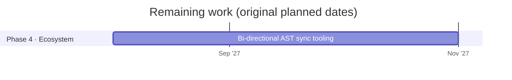

# Omni-IR roadmap

Updated 2026-10-02. Planned dates for the remaining work are kept from the original phased rollout; the work already finished came in ahead of that plan.

## Done

| Phase | Work | Where |
|---|---|---|
| 1 · Core spec | Syntax spec v0.1 draft | [SPEC.md](../SPEC.md) |
| 1 · Core spec | Zod validation schemas | `packages/core/src/schema.ts` |
| 1 · Core spec | Zod schemas and parser published on npm as [`@omni-ir/core`](https://www.npmjs.com/package/@omni-ir/core) 0.1.0 | `packages/core/` |
| 1 · Core spec | Conformance suite (63 cases, including one per component) | [conformance/](../conformance/README.md) |
| 2 · Web reference | Streaming parser in TypeScript, written test-first | `packages/core/` |
| 2 · Web reference | React Trusted Catalog and renderer, with McpMutation governance | `packages/react/` |
| 2 · Web reference | Express streaming server with a free mock model and an opt-in Claude adapter | `server/` |
| 2 · Web reference | Interactive Playground, with its visual design (light and dark, phone layout) | `playground/` |
| 2 · Web reference | Images, ratings, date fields, lists and chat messages | `packages/react/`, `app/assets.ts` |
| 3 · Cross-platform | iOS (SwiftUI) renderer: native parser passing all 63 conformance cases, SwiftUI catalog, streaming client, demo app | `swift/`, `Package.swift` |
| 3 · Cross-platform | Android (Compose) renderer: Kotlin parser passing all 63 conformance cases, Compose catalog, streaming client, demo app | `android/` |
| 2 · Web reference | React Catalog SDK published on npm as [`@omni-ir/react`](https://www.npmjs.com/package/@omni-ir/react) 0.1.0, with approved, token-free releases | `packages/react/`, `.github/workflows/release.yml` |

## Planned

Phases 1, 2 and 3 are complete: the iOS and Android renderers came in well ahead of their 2027 dates. Phase 4 starts with a written goal for the AST sync tooling.

## Not yet scheduled

- Real backend tool handlers with authorization, in place of the stubs.
- A check of how well a real model follows the protocol (free manual check with `npm run validate`, or a paid run only with the owner's go-ahead).
- A written goal for the bi-directional AST sync tooling, before that work starts.

## Go-to-market strategy

Added 2026-10-02 from the owner's plan. These phases are business stages, numbered separately from the technical phases above (GTM 1–4). Notes in *italics* record where the work stands.

### GTM 1 · Establish the open-source funnel (authority and lead generation)

You cannot sell the implementation until the standard is respected. The goal of this phase is strictly to build trust and capture enterprise leads.

- **Launch the polish:** ship the accessible, light-themed landing page with the interactive playground. This proves the tech works seamlessly. *The landing page (v5) and the playground exist; the landing page is published as an artifact, and the playground is a Vite app that isn't hosted yet.*
- **Publish the packages:** release the schema and the React SDK on npm. *Done: [`@omni-ir/core`](https://www.npmjs.com/package/@omni-ir/core) (schema and parser) and [`@omni-ir/react`](https://www.npmjs.com/package/@omni-ir/react) 0.1.0. Next release: `v0.2.0`.*
- **The lead capture:** at the bottom of the landing page and the GitHub README, a clear call to action: "Need this integrated into your enterprise architecture? Work with the creators." Link it directly to a high-ticket consulting intake form. *Not started: needs the intake form and its link.*

### GTM 2 · The agency accelerator (immediate cash flow)

Before selling Omni-IR to developers, use it as a proprietary internal tool to increase the agency's margins.

- **Sell the solution, not the code:** when a B2B client needs a complex AI workflow automation or a custom internal dashboard, sell the finished business outcome rather than the tooling behind it.
- **Accelerated delivery:** use Omni-IR internally to generate the client's frontend interfaces in a fraction of the time hand-written React components take. Because the schema is strict, the usual AI debugging phase is largely avoided.
- **Margin expansion:** charge the standard market rate for a custom software solution (for example $15k–$30k) while Omni-IR cuts development time, so margins grow. *The time saving (the plan's working figure is 70%) is an estimate to measure on the first projects, not yet a measured number.*

### GTM 3 · Enterprise governance consulting (high-ticket sales)

Large organizations want to deploy generative AI, but their IT departments worry about models producing malicious code or breaking compliance. This is where the creators step in as architects.

- **Sell the Trusted Catalog build-out:** pitch enterprise clients a secure generative UI architecture, with a premium consulting fee to map their existing corporate design system into a bespoke Omni-IR Trusted Catalog.
- **MCP-UI security audits:** because Omni-IR enforces strict tool boundaries, sell compliance and security integration: wire their internal databases and APIs to the Omni-IR mutation layer, so the AI can only take actions their corporate permissions explicitly authorize. *Depends on real backend tool handlers with authorization (see "Not yet scheduled").*
- **Retainers:** once the custom catalog is built, a monthly retainer to maintain the schema, update the renderers and keep the bi-directional sync stable as their design system evolves. *The bi-directional AST sync is Phase 4 work, not built yet.*

### GTM 4 · Platformizing the infrastructure (SaaS scale)

Once the agency model generates strong cash flow and has shown exactly what enterprise clients need, package the backend as a SaaS product.

- **Hosted parsing and sync:** managing streaming line buffers and AST structural sharing is hard for developers. Launch a hosted API (planned on Next.js and Supabase) that does the heavy lifting: developers stream the raw model text to the endpoint and get back a validated, reactive JSON AST.
- **Usage-based pricing:** the open-source protocol stays free; charge for compute on the hosted validation and parsing engine.
