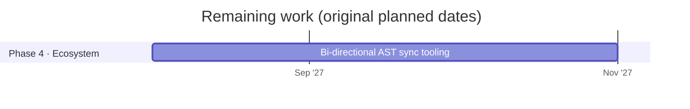

# Omni-IR roadmap

Updated 2026-10-06. Planned dates for the remaining work are kept from the original phased rollout; the work already finished came in ahead of that plan.

## Done

| Phase | Work | Where |
|---|---|---|
| 1 · Core spec | Syntax spec v0.1 draft | [SPEC.md](../SPEC.md) |
| 1 · Core spec | Zod validation schemas | `packages/core/src/schema.ts` |
| 1 · Core spec | Zod schemas and parser published on npm as [`@omni-ir/core`](https://www.npmjs.com/package/@omni-ir/core) 0.1.0 | `packages/core/` |
| 1 · Core spec | Conformance suite (96 cases, including one per component, and 21 transport cases) | [conformance/](../conformance/README.md) |
| 2 · Web reference | Streaming parser in TypeScript, written test-first | `packages/core/` |
| 2 · Web reference | React Trusted Catalog and renderer, with McpMutation governance | `packages/react/` |
| 2 · Web reference | Express streaming server with a free mock model and an opt-in Claude adapter | `server/` |
| 2 · Web reference | Interactive Playground, with its visual design (light and dark, phone layout) | `playground/` |
| 2 · Web reference | Images, ratings, date fields, lists and chat messages | `packages/react/`, `app/assets.ts` |
| 3 · Cross-platform | iOS (SwiftUI) renderer: native parser passing all the conformance cases, SwiftUI catalog, streaming client, demo app | `swift/`, `Package.swift` |
| 3 · Cross-platform | Android (Compose) renderer: Kotlin parser passing all the conformance cases, Compose catalog, streaming client, demo app | `android/` |
| 2 · Web reference | React Catalog SDK published on npm as [`@omni-ir/react`](https://www.npmjs.com/package/@omni-ir/react) 0.1.0, with approved, token-free releases | `packages/react/`, `.github/workflows/release.yml` |
| Since then | Comparison with OpenUI Lang, A2UI, json-render, HTML and React: size, streaming, coverage, capabilities and a reliability run (both formats 9 of 9) | [docs/COMPARISON.md](COMPARISON.md), `benchmarks/` |
| Since then | Catalog expansion: Select, Switch, Table/TableRow, Tabs/Tab and Notice on web, iOS and Android | [PLAN-CATALOG.md](../PLAN-CATALOG.md) |
| Since then | Charts: BarChart, LineChart and PieChart with Series and Slice on web, iOS and Android; the comparison's coverage of OpenUI's scenarios went from 3 of 7 to 5 | [PLAN-CHARTS.md](../PLAN-CHARTS.md) |
| Release | `v0.2.0` (2026-10-04): both npm packages and the first Swift Package Manager version; see [CHANGELOG.md](../CHANGELOG.md) | `.github/workflows/release.yml` |
| Since then | Open to outsiders: a public website with the playground running in the browser, a docs site, the landing page, and contributor, governance, conduct and security documents; GitHub Discussions on | [jdsouza1.github.io/omni-ir](https://jdsouza1.github.io/omni-ir/), [PLAN-OPEN.md](../PLAN-OPEN.md) |
| Since then | Proof and hardening: a cross-model check (Gemini, GPT, Llama) that fixed two prompt problems; fuzz testing on all three parsers with a 2,000-stream cross-language corpus and a weekly long run; adversarial security tests; linear-time parsing (20,000 components: 58 s to 0.4 s); new limits on nesting and document size. Four real problems found and fixed. The Gemini results were confirmed on the official Gemini app (5 of 5 valid) | [PLAN-HARDENING.md](../PLAN-HARDENING.md), [model check](model-check-2026-10-05-models.md) |
| Release | `v0.3.0` (2026-10-05): the charts, on npm and Swift Package Manager | [CHANGELOG.md](../CHANGELOG.md) |
| Release | `v0.4.0` (2026-10-06): proof and hardening (nesting and size limits, linear parsing), on npm and Swift Package Manager | [CHANGELOG.md](../CHANGELOG.md) |
| Since then | Transport standard: how a screen travels from a server to an app is now in the spec (section 10), with 21 transport conformance cases passed by the web, iOS and Android clients; stream versions with an "update the app" notice; screens over AG-UI (`@omni-ir/core/ag-ui`); rate limits behind a proxy | [PLAN-TRANSPORT.md](../PLAN-TRANSPORT.md), [transport guide](../site/docs/guide/transport.md) |
| Release | `v0.5.0` (2026-10-06): the transport standard, stream versions and AG-UI, on npm and Swift Package Manager | [CHANGELOG.md](../CHANGELOG.md) |
| Since then | Real backend handlers in the reference server: an access rule for every tool, sign-in by emailed link with sessions for browsers and tokens for native apps, ownership checks that answer "not found" for other people's data, storage in memory or SQLite, idempotency keys in the spec and all three clients, an audit trail without personal data, and per-person limits. Unreleased, for 0.6.0 | [PLAN-BACKEND.md](../PLAN-BACKEND.md), [guide](../site/docs/guide/actions.md) |

## Planned

Phases 1, 2 and 3 are complete: the iOS and Android renderers came in well ahead of their 2027 dates. Phase 4 starts with a written goal for the AST sync tooling, after the steps below.

## Next, in priority order

Reprioritized 2026-10-05 after a review of the project's gaps. The cheap, free work that lets outsiders find, try and trust Omni-IR comes first; the larger protocol steps follow. Each step starts with its own plan and checklist for the owner's approval.

1. **Step 16 · Themes and languages.**
   - [ ] A design-token layer: brand colours, fonts and corner radius set by the app, never by the model, on web, iOS and Android
   - [ ] A dark theme for the web catalog (it is light-only today)
   - [ ] The renderers' own text ("Choose a date", "Component failed to load") translated, following the platform's locale
2. **Step 17 · App-defined components.** An app registers its own components, each with its own schema, the way it registers tools, so a model can use them while every line is still checked and governed. This answers "the catalog isn't enough" without leaving Omni-IR.
   - [ ] Pictures looked up by the app when the screen is drawn (for example `product-123`), for shops and user pictures that can't all be registered in advance; the model still never writes a URL
   - [ ] Keep the system prompt small as the catalog grows: send only the components a request is likely to need, and measure the cost and the time to the first line
3. **Step 18 · Live screens.** Screens are snapshots today: a component can't change after its line arrives. Specify updating and removing components, and live data in charts and tables, without adding logic to the stream (listed under "Not yet specified" in SPEC.md).

## Later

- **Automated LLM red teaming with Promptfoo** (optional; OWASP LLM Top 10, attacker models generating jailbreaks and indirect injections, run against each supported model). It calls paid model APIs, so only as a capped manual run with the owner's go-ahead, never in CI
- **A human red team** for chained attacks before real handlers handle real data, with the owner's go-ahead (an outside hire).

- **Android on Maven Central.** Needs a free Sonatype account and a signing key, created by the owner; until then apps include the modules from this repository.
- **Accessibility audit with real screen readers** (VoiceOver, TalkBack, NVDA) on real devices, beyond today's automated checks.
- **External security review** of the parsers and governance, once fuzz testing and the adversarial boundary tests are in place. Only with the owner's go-ahead, since it may cost money. A human red team (below) can cover it.
- **Eject to code**, only when a client asks: export a screen as readable React (then SwiftUI) that keeps calling the same checked tool layer. Built per project when there is demand; the benchmark's React converter is a starting point. Until then, Omni-IR is open source (Apache-2.0), so no one is locked in.
- **Phase 4 · Bi-directional AST sync**, starting with a written goal (see the timeline above).
