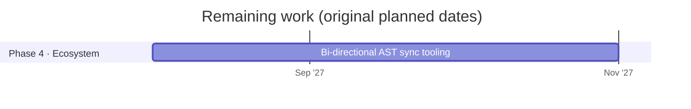

# Omni-IR roadmap

Updated 2026-10-04. Planned dates for the remaining work are kept from the original phased rollout; the work already finished came in ahead of that plan.

## Done

| Phase | Work | Where |
|---|---|---|
| 1 · Core spec | Syntax spec v0.1 draft | [SPEC.md](../SPEC.md) |
| 1 · Core spec | Zod validation schemas | `packages/core/src/schema.ts` |
| 1 · Core spec | Zod schemas and parser published on npm as [`@omni-ir/core`](https://www.npmjs.com/package/@omni-ir/core) 0.1.0 | `packages/core/` |
| 1 · Core spec | Conformance suite (63 cases, including one per component) | [conformance/](../conformance/README.md) |
| 2 · Web reference | Streaming parser in TypeScript, written test-first | `packages/core/` |
| 2 · Web reference | React Trusted Catalog and renderer, with McpMutation governance | `packages/react/` |
| 2 · Web reference | Express streaming server with a free mock model and an opt-in Claude adapter | `server/` |
| 2 · Web reference | Interactive Playground, with its visual design (light and dark, phone layout) | `playground/` |
| 2 · Web reference | Images, ratings, date fields, lists and chat messages | `packages/react/`, `app/assets.ts` |
| 3 · Cross-platform | iOS (SwiftUI) renderer: native parser passing all 63 conformance cases, SwiftUI catalog, streaming client, demo app | `swift/`, `Package.swift` |
| 3 · Cross-platform | Android (Compose) renderer: Kotlin parser passing all 63 conformance cases, Compose catalog, streaming client, demo app | `android/` |
| 2 · Web reference | React Catalog SDK published on npm as [`@omni-ir/react`](https://www.npmjs.com/package/@omni-ir/react) 0.1.0, with approved, token-free releases | `packages/react/`, `.github/workflows/release.yml` |
| Since then | Comparison with OpenUI Lang, A2UI, json-render, HTML and React: size, streaming, coverage, capabilities and a reliability run (both formats 9 of 9) | [docs/COMPARISON.md](COMPARISON.md), `benchmarks/` |
| Since then | Catalog expansion: Select, Switch, Table/TableRow, Tabs/Tab and Notice on web, iOS and Android (unreleased until `v0.2.0`) | [PLAN-CATALOG.md](../PLAN-CATALOG.md) |

## Planned

Phases 1, 2 and 3 are complete: the iOS and Android renderers came in well ahead of their 2027 dates. Phase 4 starts with a written goal for the AST sync tooling.

## Not yet scheduled

- Charts (Step 11): the remaining gap found by the format comparison; a big build on three platforms, so it gets its own plan.
- Real backend tool handlers with authorization, in place of the stubs.
- A check of how well a real model follows the protocol (free manual check with `npm run validate`, or a paid run only with the owner's go-ahead).
- A written goal for the bi-directional AST sync tooling, before that work starts.
